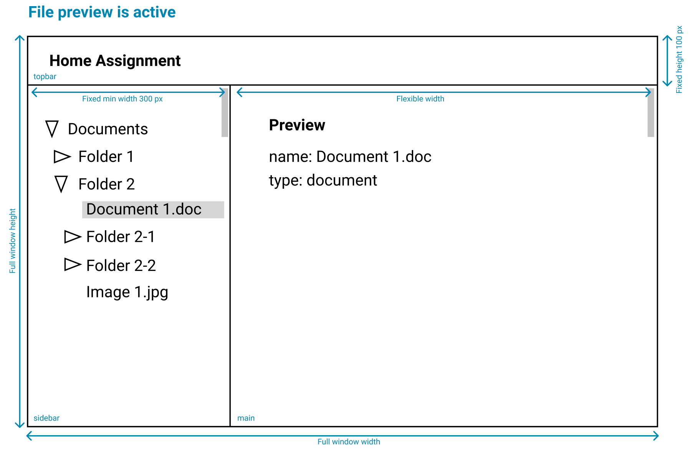

# Directory Browser

Example for displaying a file system directory structure. Items can only be one of two types - file or folder, which should be visually distinguishable.

**Folder is active**


**File preview is active**



### User story 1 - View tree

As a user I can see the files and folders rendered as a tree structure in the `sidebar`, where contents of the folder are **ordered alphabetically**.

### User story 2 - Expand/collapse

As a user I can click once on a folder in the `sidebar` to expand/collapse it's contents. The same click will also make the folder active. Expanding/collapsing a folder should not result in previously expanded/collapsed folders to change state.

### User story 3 - Activating a file/folder in sidebar

As a user I can click on a folder or file in the `sidebar` to make it active. Currently active file/folder should be displayed in the `main` area.

- Active folder should display it's contents in the `main` area.
- Active file should display it's name and type in the `main` area.

### User story 4 - Activating a file/folder in main area

As a user I can click on a file or folder in the `main` area to activate it. When activated, it should also expand the path to the folder in the `sidebar` tree.


## How to work

This is a `vite` bootstraped project with `typescript`.

You can run both the API server and the frontend client with the single command:

```
npm start
```

API server will be available from your client by requesting this url `http://localhost:8010/api/v1/tree`

```js
fetch('http://localhost:8010/api/v1/tree');
```
